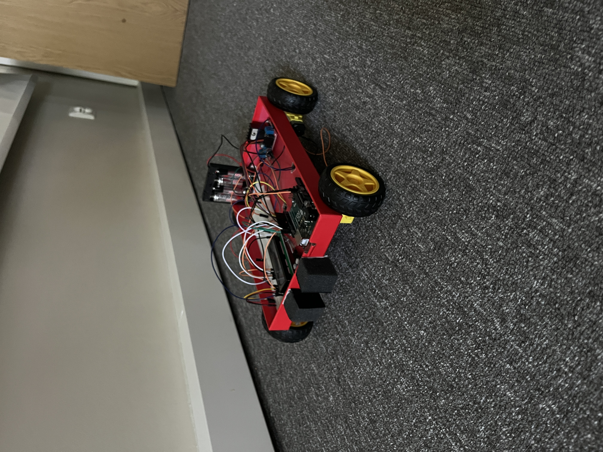

# 🚗 Projekt Samochodu 4x4 z Podwójną Blokadą Awaryjną i LCD

Projekt inteligentnego pojazdu gąsienicowego/kołowego z napędem **4x4**, opartego na platformie **Arduino Uno**. Pojazd posiada zaawansowany system bezpieczeństwa monitorujący przestrzeń przed oraz pod robotem, a aktualny stan pracy jest wyświetlany w czasie rzeczywistym na ekranie LCD.

---

## 📸 Prezentacja auta

---

## 🛠️ Funkcje Projektu
* **Pełny napęd 4x4** – sterowany za pomocą wydajnego mostka H (L298N).
* **Podwójny wyłącznik awaryjny (Safety First):**
  * **Czujnik KY-032 (przód):** Automatycznie zatrzymuje pojazd po wykryciu ściany lub przeszkody.
  * **Czujnik TCRT5000 (dół):** Zatrzymuje pojazd po najechaniu na czarną linię (np. krawędź stołu lub linię STOP).
* **Komputer Pokładowy LCD 1602A** – wyświetla pełne, dwulinijkowe komunikaty o statusie jazdy i przyczynach zatrzymania.

---
**Made by Franciszek Markul, Kacper Kazimierczuk, Anna Dorobis, Wojtek Berlusconi**
